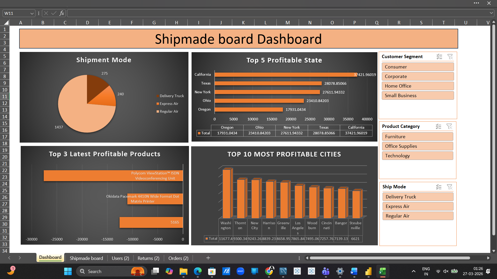

# 📊 Shipment Dashboard (Excel)

## 🔍 Overview
This project presents an interactive Excel dashboard to analyze shipment modes, profitability, and regional performance.

---

## 📷 Dashboard Preview

---

## 📊 Key Insights
- Regular Air is the most used shipment mode  
- California is the most profitable state  
- Top cities contribute major share of profits  
- Certain products generate higher margins  

---

## 🛠 Tools Used
- Microsoft Excel  
- Data Visualization  
- Dashboard Design  

---

## 📁 Files
- Shipment Dashboard (.xlsx)
- Dashboard Image (.png)

---

## 🚀 How to Use
1. Download the Excel file  
2. Open in Microsoft Excel  
3. Use filters to explore insights  

---

## 📌 Objective
To analyze shipment and profitability data and identify key business insights.
